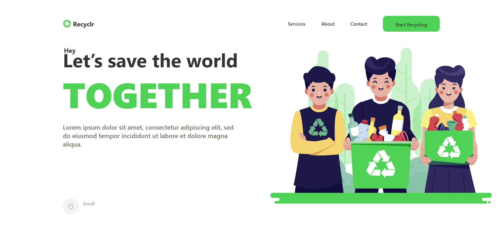

<a href="https://recyclrr.netlify.app/" target="_blank" style="display:flex;gap:1rem;align-items:center;justify-content:center;">

<p style="font-size:5rem;font-weight:bold;">Recyclr</p>
</a>

<div align="center">
<a traget="_blank" href="https://github.com/rahulrajdahal/Recyclr/actions/workflows/unit-test.yaml">

</a> <a target="_blank" href="https://app.netlify.com/projects/recyclrr/deploys">

</a>
</div>
<p align="center">
<em>Let’s save the world TOGETHER</em>
</p>

## [Demo](https://recyclrr.netlify.app/)

## [Source](https://github.com/rahulrajdahal/Recyclr)

## 🏗 Installation

### 1. clone the repository

```sh
git clone https://github.com/rahulrajdahal/Recyclr.git
```

### 2. Install Dependencies

#### pnpm

```sh
cd Recyclr && pnpm install
```

### 3. Run development server

```sh
pnpm run dev
```

#### OR

### Run Production server

```sh
pnpm run preview
```

## Preview

[](https://recyclrr.netlify.app/)

## 🚀 Project Structure

Inside of project [Recyclr](https://recyclrr.netlify.app/), you'll see the following folders and files:

```text
/
├── public/
│   └── logo.svg
├── src/
|   ├── assets/
│   │   ├── icon.svg
|   ├── components/
│   │   ├── Component.tsx
|   ├── pages/
│   │   ├── Page.tsx
└── index.html
└── tailwind.config.js
└── pwa-assets.config.ts
└── README.md
└── package.json
```

## 🧞 Commands

All commands are run from the root of the project, from a terminal:

| Command            | Action                                        |
| :----------------- | :-------------------------------------------- |
| `pnpm install`     | Installs dependencies.                        |
| `pnpm run dev`     | Starts local dev server at `localhost:5173`.  |
| `pnpm run build`   | Build your production site to `./dist/`.      |
| `pnpm run preview` | Preview your build locally, before deploying. |
| `pnpm run lint`    | Check all linting errors.                     |
